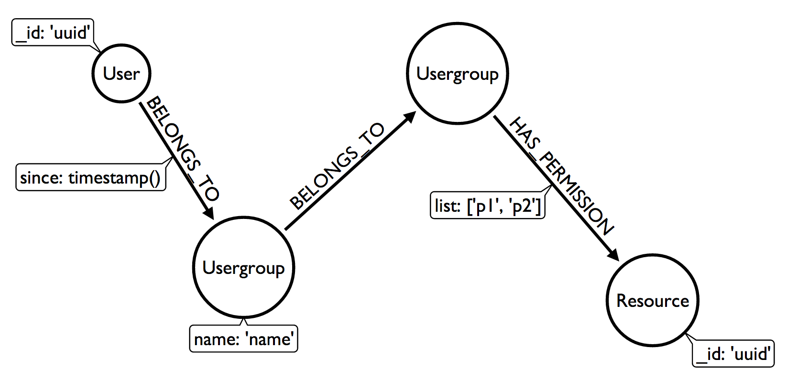

# Neo4ACL
## Access Control Lists on top of Neo4j

Inspired by [NODE ACL](https://github.com/OptimalBits/node_acl)

----------

## Install
```bash
npm install neo4acl
```

----------


## Setup & configuration


```javascript

var Neo4ACL = require('neo4acl');

var acl = Neo4ACL(options);

/*

The Neo4ACL() function takes an optional configuration object

options = {

    url: 					    The Neo4j REST server url.
						        Default: process.env.NEO4J_URL || 'http://localhost:7474'
					
    user_label: 				Label of nodes representing users.
    							Default: 'User'
    
    user_id_key:				Name of the user id property.
    							Default: '_id'
    				
    group_label:				Label of nodes representing usergroups.
    							Default: 'Usergroup'
    				
    group_name_key: 			Name of the group name property.
    							Default: 'name'
    				
    res_label: 					Label of nodes representing resources.
    							Default: 'Resource'
    				
    res_id_key:					Name of the resource id property.
    							Default: '_id'
    				
    belongs:					Name of the relation connecting user to group and group to group
    							Default: 'BELONGS_TO'
    				
    has_permission: 			Name of the relation connecting group to resource
	    						Default: 'HAS_PERMISSION'
    				
    has_permission_list_key: 	Name of the relation property containing the permissions list.
    						 	Default: 'list'
}

*/

```
## (not so) Quick example
```javascript

var Neo4acl = require('neo4acl');

var acl = Neo4acl();

// Let's say we already have two users in the graph
// {_id:'giacomo'} and {_id:'bob'}
// and no groups or resources

var giacomo_groups; // <- We'll use this variable later...

acl
  .addUserToGroups('giacomo', ['admins', 'italian_users']).execute()
  .then(acl.addUserToGroups('bob', ['english_users']).execute)
  .then(acl.addGroupParents('admins', 'users').execute)
  .then(acl.addGroupParents('italian_users', ['users']).execute)
  .then(acl.addGroupParents('english_users', 'users').execute)
  .then(acl.giveResourcesPermissions('italian_users', 'italian_content', ['view']).execute)
  .then(acl.giveResourcesPermissions('english_users', 'english_content', ['view']).execute)
  .then(acl.giveResourcesPermissions('users', 'common_content', ['view']).execute)
  .then(acl.giveResourcesPermissions('admins', [
                                                'common_content',
                                                'italian_content',
                                                'english_content'
                                                ],
                                                ['view', 'post', 'put', 'delete', 'special_permission']
                                    ).execute)

  .then(acl.isUserInAllGroups('giacomo', ['admins', 'italian_users']).execute)
  .then(function(giacomo_is) {
    console.log('\nGiacomo is member of admins AND italian_users: ' + giacomo_is); // -> true

    return acl.isUserInAllGroups('bob', ['english_users', 'admins']).execute();
  })      
  .then(function(bob_is) {
    console.log('\nBob is member of english_users AND admins: ' + bob_is); // -> false

    return acl.isUserInAnyGroup('bob', ['english_users', 'admins']).execute();
  })
  .then(function(bob_is) {
    console.log('\nBob is member of english_users OR admins: ' + bob_is); // -> true

    return acl.hasUserAllPermissionsOnResources('bob', 'english_content', 'view', function(err, has_bob) {
      console.log('\nBob can \'view\' english_content: ' + has_bob); // -> true
    });
  })
  .then(function() {
    var acl_query = acl.hasUserAllPermissionsOnResources('giacomo', ['italian_content', 'english_content', 'common_content'], ['view', 'post', 'special_permission']);

    console.log('\nLet\'s wait 5 seconds....');
    setTimeout(function() {
      acl_query.execute();
    }, 100);

    acl_query.then(function(has_giacomo) {
      console.log(
                  ['\nGiacomo has permissions \'view\', \'post\' and \'special_permission\'',
                   'on resources \'italian_content\', \'english_content\' and \'common_content\': ' + has_giacomo
                  ].join('\n')
                 );
    });

    return acl_query;
  })   
  .then(function() {
    return acl.denyResourcesPermission('english_users', 'english_content', 'view', function(err, done) {
      console.log('\nNow english users CAN NOT \'view\' english_content.');
    });
  })
  .then(function() {
    return acl.hasUserAllPermissionsOnResources('bob', 'english_content', 'view', function(err, bool) {
      console.log('\nBob can \'view\' english_content: ' +bool); // -> false
    });
  })
  .then(function() {
    return acl.hasUserAllPermissionsOnResources('bob', 'common_content', 'view', function(err, bool) {
      console.log('\nBob can \'view\' common_content: ' +bool);// -> true
    });
  })
  .then(function() {
    return acl.getUserGroups('bob', function(err, groups) {
      console.log('\nBob is in the following groups:');
      console.log(util.inspect(groups, {depth: null}));
    });
  })
  .then(function() {
    return acl.getUserGroups('giacomo', function(err, groups) {
      giacomo_groups = groups; // Here we are...
      console.log('\nGiacomo is in the following groups:');
      console.log(util.inspect(groups, {depth: null}));
    });
  })
  .then(function(g_groups) {
    if (giacomo_groups === g_groups) console.log('\nIn Neo4acl the same objects are used both to resolve promises and to feed callbacks.');
  });
  
```
## Graph desing



## Api
***
[acl.addUserToGroups()](#addUserToGroups)

[acl.removeUserFromGroups()](#removeUserFromGroups)

[acl.getUserGroups()](#getUserGroups)

[acl.isUserInAllGroups()](#isUserInAllGroups)

[acl.isUserInAnyGroup()](#isUserInAnyGroup)

[acl.addGroupParents()](#addGroupParents)

[acl.removeGroup()](#removeGroup)

[acl.removeResource()](#removeResource)

[acl.giveResourcesPermissions()](#giveResourcesPermissions)

[acl.denyResourcesPermission()](#denyResourcesPermission)

[acl.getResourcesPermissions()](#getResourcesPermissions)

[acl.isAllowed()](#isAllowed)

[acl.isAllowedAny()](#isAllowedAny)

[acl.areAnyGroupsAllowed()](#areAnyGroupsAllowed)

----------

### <a id="addUserToGroups">-></a> acl.addUserToGroups( user_id , groups, cb(err, done) {}
Parameters:

- **user_id** {String || Number} User id
- **groups** {String || [String, ...]} Group(s)
- **cb** {Function} [optional]
	- **err** {Object} A Neo4j REST API Layer error
	- **done** {Boolean}

Ad the user to the listed groups.

----------

### <a id="removeUserFromGroups"></a>acl.removeUserFromGroups( user_id, groups, cb(err, done) )
Parameters:

- **user_id** {String || Number} User id
- **groups** {String || [String, ...]} Group(s)
- **cb** {Function} [optional]
	- **err** {Object} A Neo4j REST API Layer error
	- **done** {Boolean}

Removes the user from the listed groups.

----------

### <a id="getUserGroups"></a>acl.getUserGroups( user_id, cb(err, groups) )
Parameters:

- **user_id** {String || Number} User id
- **cb** {Function} [Optional]
    - **err** {Object} A Neo4j REST API Layer error
    - **groups** {Array} The list of groups the user belongs to
```javascript
        groups = [
                    {
                        name: 'Role name',
                        distance: 1
                    },
                    {...}
                ] 
```
Returns an array of the groups the user belongs to.

For each group, the ```distance``` property tells if the user is a direct member of the group (if ```distance === 1```) or if she's N groups away.

----------

### <a id="isUserInAllGroups"></a>acl.isUserInAllGroups( user_id, groups, cb(err, bool) )
Parameters:

- **user_id** {String || Number} User id 
- **groups** {String || [String, ...]} Group(s)
- **cb** {Function} [Optional]
    - **err** {Object} A Neo4j REST API Layer error
    - **bool** {Boolean}

Checks if the user belongs to each of the listed groups

----------

### <a id="isUserInAnyGroup"></a>acl.isUserInAnyGroup( user_id, groups, cb(err, bool) )
Parameters:

- **user_id** {String || Number} User id 
- **groups** {String || [String, ...]} Group(s)
- **cb** {Function} [Optional]
    - **err** {Object} A Neo4j REST API Layer error
    - **bool** {Boolean}

Checks if the user belongs to any of the listed groups

----------

### <a id="addGroupParents"></a>acl.addGroupParents( group, parents, cb(err, done) )
Parameters:

- **group** {String} Group
- **parents** {String || [String, ...]} Parent(s)
- **cb** {Function} [Optional]
    - **err** {Object} A Neo4j REST API Layer error
    - **done** {Boolean}

Set the given group as belonging to the listed parent groups.

----------

### <a id="removeGroup"></a>acl.removeGroup( group, cb(err, done) )
Parameters:

- **group** {String} Group
- **cb** {Function} [Optional]
    - **err** {Object} A Neo4j REST API Layer error
    - **done** {Boolean}

Removes the group and all it's permissions from the system.

----------

### <a id="removeResource"></a>acl.removeResource( resource_name, cb(err, done) )
Parameters:

- **resource_name** {String} Resource name
- **cb** {Function} [Optional]
    - **err** {Object} A Neo4j REST API Layer error
    - **done** {Boolean}

Removes the resource from the system.

----------

### <a id="giveResourcesPermissions"></a>acl.giveResourcesPermissions( groups, resources, permissions, cb(err, done) )
Parameters:

- **groups** {String || [String, ...]} Group(s)
- **resources** {String || [String, ...]} Resource(s)
- **permissions** {String || [String, ...] Permission(s)
- **cb** {Function} [Optional]
    - **err** {Object} A Neo4j REST API Layer error
    - **done** {Boolean}

Gives to the listed groups the listed permissions over the listed resources.

----------

### <a id="denyResourcesPermission"></a>acl.denyResourcesPermission( groups, resources, permissions, cb(err, done) )
Parameters:

- **groups** {String || [String, ...]} Group(s)
- **resources** {String || [String, ...]} Resource(s)
- **permissions** {String || [String, ...] Permission(s)
- **cb** {Function} [Optional]
    - **err** {Object} A Neo4j REST API Layer error
    - **done** {Boolean}

Removes the listed permissions over the listed resources from the listed groups.

----------

### <a id="getResourcesPermissions"></a>acl.getResourcesPermissions( user_id, resources, cb(err, resources) )
Parameters:

- **user_id** {String || Number} User id
- **resources** {String || [String, ...]} Resource(s)
- **cb** {Function} [Optional]
    - **err** {Object} A Neo4j REST API Layer error
    - **resources** {Array}
```javascript
        resources = [
                        {
                            name: 'Resource name',
                            permissions: [String, ...]
                        },
                        {...}
                    ]
```
Checks the permissions a user has over the listed resources.
Returns an array of resources.

----------

### <a id="isAllowed"></a>acl.isAllowed( user_id, resources, permissions, cb(err, allowed) )
Parameters:

- **user_id** {String || Number} User id
- **resources** {String || [String, ...]} Resource(s)
- **permissions** {String || [String, ...] Permission(s)
- **cb** {Function} [Optional]
    - **err** {Object} A Neo4j REST API Layer error
    - **allowed** {Boolean}

Checks if the user has ALL the listed permissions over all the listed resources.

----------

### <a id="isAllowedAny"></a>acl.isAllowedAny(user_id, resources, permissions, cb(err, allowed) )
Parameters:

- **user_id** {String || Number} User id
- **resources** {String || [String, ...]} Resource(s)
- **permissions** {String || [String, ...] Permission(s)
- **cb** {Function} [Optional]
    - **err** {Object} A Neo4j REST API Layer error
    - **allowed** {Boolean}

For each of the listed resources, checks if the user has ANY of the listed permission.

----------
    
### <a id="areAnyRolesAllowed"></a>acl.areAnyRolesAllowed( groups, resources, permissions, callback(err, allowed) )
Parameters:

- **groups** {String || [String, ...]} Group(s)
- **resources** {String || [String, ...]} Resource(s)
- **permissions** {String || [String, ...] Permission(s)
- **cb** {Function} [Optional]
    - **err** {Object} A Neo4j REST API Layer error
    - **allowed** {Boolean}

Checks if any of the listed groups has ALL the listed permissions over all the listed resources.